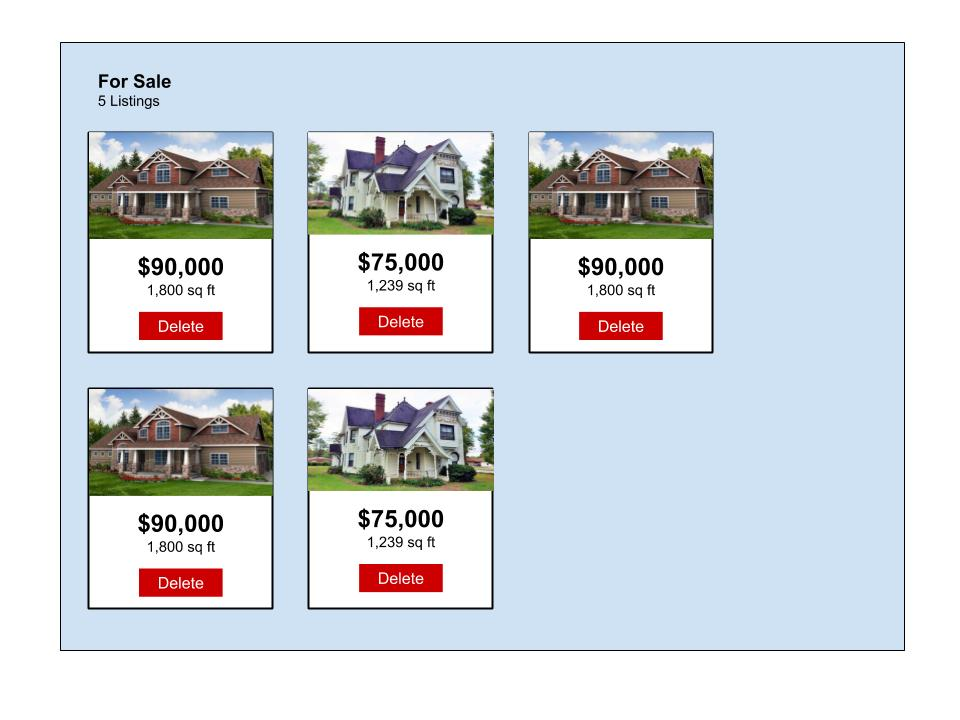

# Real Estate Listings 

## Technologies Used
- jQuery 
- Express
- Node
- SQL

## Objectives
- Create a Full Stack application from the ground.
- Create a table structure to support the provided test data.
- Account for different data properties ("rent" versus "sale") when displaying information on the page.
- Implement a Card layout to display information.

## Overview
For this project you will take on the role of an application developer for a real estate company. You will be working with data that we will be providing to you. (See the `listings.sql` file.) The data contains information for properties that are either for "rent" or for "sale".

You job is to display this data onto the DOM, grouped under two headings, `For Rent` and `For Sale`. There should be a header at the top of the page with navigation links that will go to each section.

An additional section at the top of the page will contain a form that will allowing a new property to be added. 

### Views and Layout

Here is a mockup of a card-based layout for real estate listings. This is a guide for the Rental and Sale sections. Feel free to improvise.

The `Card` interface component is very common across the web. They are in your future!

Bootstrap includes a card element, as do most popular CSS frameworks. Otherwise, creating one with your own CSS isn't so bad. W3 even has a page on it: [https://www.w3schools.com/howto/howto_css_cards.asp](https://www.w3schools.com/howto/howto_css_cards.asp)

### Importing the Provided Data File

Create a database called `real_estate`. You will need import the `listings.sql` file into your database. In order to do this, you will need to create a `listings` table with a `CREATE TABLE "listings"` command. Look at the `INSERT` statements to determine which columns should be added to this table. Be sure to add your `CREATE TABLE` query to the `database.sql` file so that we can see how you did it.

## Project Requirements

- Allow a user to add a property to the database. 
  - [ ] Provide inputs for square footage, cost, type (rent or sell), and city.
  - [ ] Provide an input to allow the user to enter the name of one of the provided images to display with the new listing. 
  - [ ] Submit should add the property listing to the database and refresh the displayed listings.
  - [ ] After a successful add, clear all inputs except for type. (Staff will enter new properties of the same type in batches.)

- Create a section on the main page to show the Rental properties.
  - [ ] Display only those properties that are For Rent.
  - [ ] Display the listings in "card" elements, including the associated image. 
  - [ ] Include a `delete` button to remove an existing listing on each listing card.

- Create a section on the main page to show the Rental properties.
  - [ ] Display only those properties that are For Sale.
  - [ ] Display the listings in "card" elements, including the associated image. 
  - [ ] Include a `delete` button to remove an existing listing on each listing card.

### Tips

Don't get too hung up on the card and layout. Getting the data on the page is more important. Start with a simple layout to modify once the other functionality is working. 

Without the data, the application is useless. Spend your time wisely!

## Stretch Goals

- [ ] Create a dropdown/select so that the user doesn't need to type `sale` or `rent` for every new listing.
- [ ] Create a dropdown/select so that the user doesn't need to type the image url for every new listing.
- [ ] Add validation to the add property form. Do this on both the client and the server. 
- [ ] Add the ability to sort the results by cost or square footage.
- [ ] Add the ability to search or filter by various parameters.(Do this using a server side route with a [query parameter](https://expressjs.com/en/api.html#req.query))
- [ ] Update the navigation links so that clicking the link will update the page to display only one section of the page, either the form to add a new property, properties for rent, or properties for sale. 
- [ ] Add a Featured Properties section to display the least expensive properties of each type.
- [ ] Make the page responsive. Bootstrap Containers and Grid can be helpful for this.
